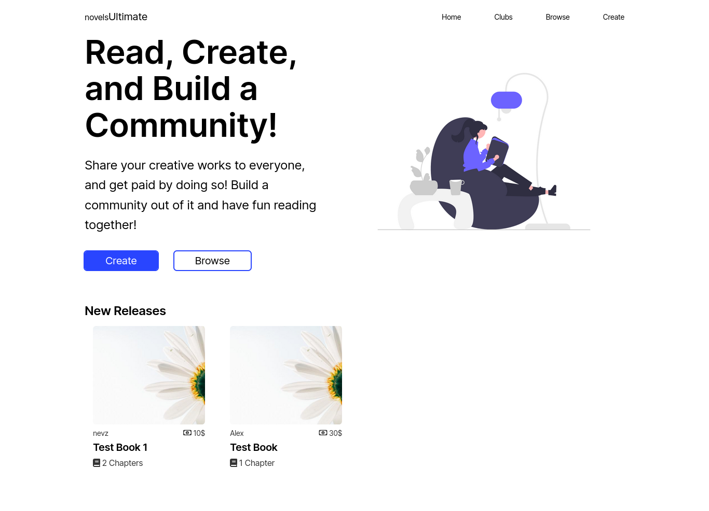

# inventory-application

Inventory Application Project for The Odin Project

## Preview

## Demo

[Live Preview]()

## Features

- CRUD operations

## Built With

## Lessons Learned

I learned a lot doing this project. The concept of MVC, modelling schemas, virtuals, request and response cycle, middlewares, and more. All that obviously still needs some work, didn't try to make the code maintanable and only practiced the concepts I've learned. Will definitely put more effort to projects after this.

This is also the first project I actually took time to design. Design is definitely one of my weakness and been watching tutorials for it, using figma to train. Honestly it was not the code itself that took a lot of time but 70% of it went with learning design. A bit of a basic design but I'm proud of it.

## Acknowledgements

- [The Odin Project](https://www.theodinproject.com/)
